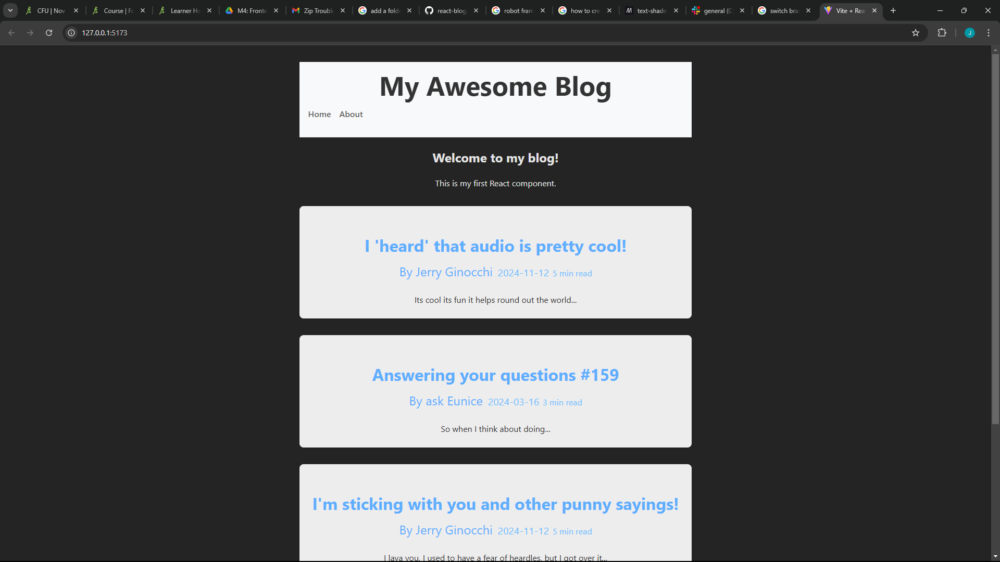
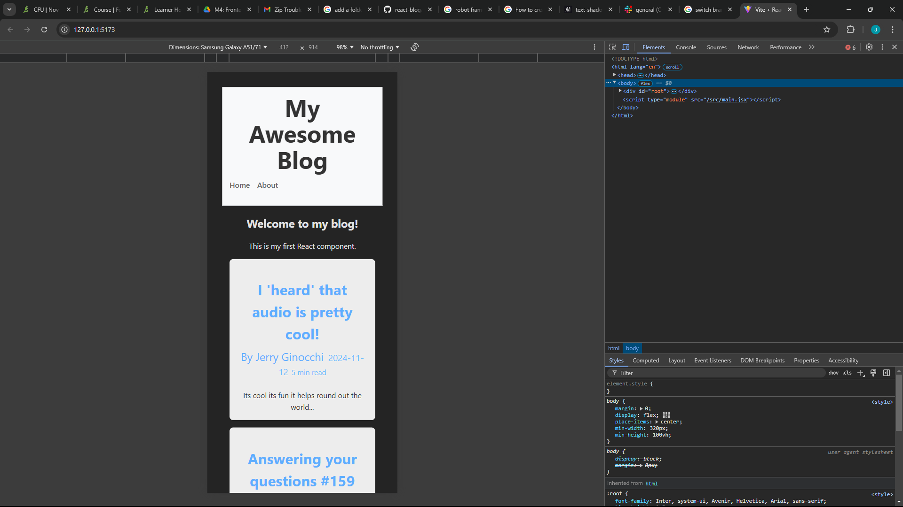
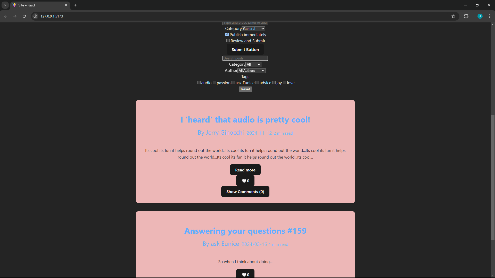
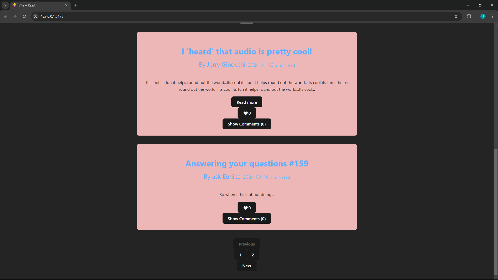

# React + Vite

# My React Blog

A blog platform built with React and Vite.

## Setup Instructions

1. Clone the repository
2. Run `npm install`
3. Run `npm run dev`
4. Open http://localhost:5173 in your browser

## Project Structure

The project is being built piece by piece Starting with the headline as seen in the screenshot below. We are and will be continuing to update this blog with features.

## Screenshot

## What I Learned

The first lesson was learned even before the coding started. File managment and how keeping it tidy is **key** to having a smooth and coherent project. Assignment 1 helped me to learn more about the way that data flows between components. For example we make changes to the style sheet in blog post that has an effect on our post.js. For Assignment 2 we focused on implementing a like button and comment section using useState to allow for the changing of either of these over time in our app.

## Components Structure

- BlogPost: Individual blog post display
- BlogList: Container for multiple posts
- Header: Navigation and site title

## Styling Approach

[Explain your chosen styling approach and why]

## New Features

[List the features you've added in this assignment]

## Screenshots

## My Header and Blog Posts

## My Blog formatted for a Galaxy A51/71

## search and Pagination

